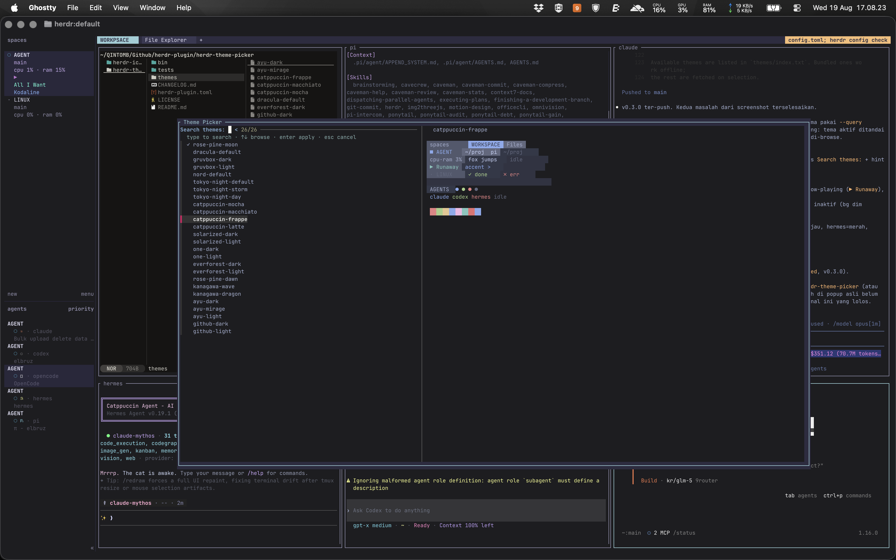

# herdr-theme-picker

<p align="center">
  
</p>

Pick any color theme from [terminalcolors.com](https://terminalcolors.com)
and apply it to your [Herdr](https://herdr.dev) UI — with a single keybind,
`prefix+t`.

Herdr ships only a handful of built-in themes (`catppuccin`, `tokyo-night`,
`gruvbox`, `solarized`, `terminal`, …). This plugin unlocks hundreds of
palettes from terminalcolors.com: pick one from a popup, and its colors are
mapped into `[theme.custom]` in your `config.toml` and reloaded automatically.

> **Scope:** the plugin recolors **Herdr's UI chrome** (panels, sidebar,
> accents) through `[theme.custom]`. It does **not** change the terminal cell
> colors (the 16 ANSI colors) — those are controlled by your terminal
> emulator (Ghostty, iTerm, …), not by Herdr.

---

## Features

- **`prefix+t`** → an fzf popup with a live truecolor swatch preview.
- **19 popular themes bundled offline** (Dracula, Gruvbox, Nord, Tokyo Night,
  Catppuccin, Solarized, One Dark, Everforest, Rosé Pine, Kanagawa, Ayu,
  GitHub, …).
- **Live-fetch** any other theme from terminalcolors.com on selection
  (needs internet), cached locally.
- **Automatic backup** of `config.toml` before writing.
- **Idempotent & reversible.**

---

## Compatibility

| | |
|---|---|
| Herdr | ≥ 0.8.0 |
| OS | macOS, Linux |
| Dependencies | `bash`, `curl`, [`fzf`](https://github.com/junegunn/fzf) |

`fzf` is usually already present if you use other Herdr plugins (file-picker,
termscope). If not: `brew install fzf` (macOS) or your distro's package.

---

## Install

### From GitHub (recommended)

Herdr installs plugins directly from a repository:

```bash
herdr plugin install qintmb/herdr-theme-picker
```

Herdr shows an install preview for review before proceeding (use `--yes` for
non-interactive install). The `prefix+t` keybind is registered by the plugin
manifest — no manual `config.toml` editing required.

Then reload the running server:

```bash
herdr server reload-config
```

**This is the only path that receives updates.** Herdr tracks the plugin's
source repo and compares the manifest `version`, so `herdr plugin install`
is how you get future fixes and new themes (see [Updating](#updating)).

### Local checkout (development only)

Use this only when hacking on the plugin itself. A linked local checkout is
**not** tracked for updates — pull changes with `git` yourself.

```bash
git clone https://github.com/qintmb/herdr-theme-picker.git
cd herdr-theme-picker
herdr plugin link "$PWD"        # or: bash bin/install.sh
herdr server reload-config
```

`bin/install.sh` is a thin convenience wrapper around `herdr plugin link` +
`reload-config` for a local checkout.

---

## Updating

If you installed from GitHub, reinstall to pull the latest release:

```bash
herdr plugin install qintmb/herdr-theme-picker
herdr server reload-config
```

Herdr resolves the repo's default branch (`main`) and detects a new release
by a bumped manifest `version`. To pin a specific commit, tag, or branch,
pass `--ref`:

```bash
herdr plugin install qintmb/herdr-theme-picker --ref v0.1.0
```

A local linked checkout does not auto-update — `git pull` in that directory
and `herdr server reload-config`.

---

## Usage

Press **`prefix+t`** (Herdr's default prefix is `cmd+b`, so `cmd+b` then `t`).

- The fzf popup opens. The **search field is at the top** — just type to
  filter themes.
- The right pane previews the theme applied to a mock Herdr layout — `spaces`
  sidebar, a two-pane workspace with the active pane highlighted, tab bar, and
  a bottom agent pane with state colors.
- **Enter** → the theme is applied, Herdr reloads, and the popup closes.
- **Esc** → cancel.

The currently applied theme is marked with `✓` and floated to the top of the
list; the rest stay browsable so you can switch freely.

### Add your own theme (from inside the picker)

A `+ Add new theme…` row is pinned at the bottom of the list. Press **Tab**
(from anywhere) or **Enter** on that row to:

1. Open your `$EDITOR` with a ghostty-format template.
2. Paste a palette (e.g. terminalcolors.com → Download → **Ghostty**), save, and close.
3. Type a name — it's slugified, validated, saved, appended to the list, and applied immediately.

User-added themes are stored in `HERDR_PLUGIN_STATE_DIR/themes` (with their own
`index.txt`), so plugin updates never overwrite them. They appear in the list
marked `★`.

Available themes are listed in `themes/index.txt`. Bundled ones work offline;
the rest are fetched on selection.

You can also trigger it without the keybind:

```bash
herdr plugin pane open --plugin herdr-theme-picker --entrypoint picker --placement popup --focus
```

---

## How it works

```
prefix+t → picker.sh (fzf)
             │  pick a slug
             ▼
          apply.sh <slug>
             │  1. resolve_palette   → themes/<slug>  or  fetch terminalcolors.com (cached)
             │  2. palette_to_tokens → 16 [theme.custom] tokens
             │  3. write config.toml (backup: config.toml.bak-YYYYMMDD)
             │  4. herdr server reload-config
             ▼
          Herdr UI updates
```

Palettes are read in **ghostty format** (`background`, `foreground`,
`palette N=#hex`), then mapped to Herdr's UI tokens:

| Herdr token | palette source | | Herdr token | palette source |
|---|---|---|---|---|
| `panel_bg` | `background` | | `text` | `foreground` |
| `surface0` | `palette 0` | | `subtext0` | `palette 7` |
| `surface1` | `palette 8` | | `accent` / `blue` | `palette 4` |
| `surface_dim` | `background` −8% | | `red` | `palette 1` |
| `overlay0` | `palette 8` | | `green` | `palette 2` |
| `overlay1` | `palette 7` | | `yellow` | `palette 3` |
| `mauve` | `palette 5` | | `teal` | `palette 6` |
| `peach` | `palette 9` | | | |

---

## Manifest

`herdr-plugin.toml` declares everything Herdr needs — the pane, the action,
and the keybind:

```toml
id = "herdr-theme-picker"
name = "Theme Picker"
version = "0.1.0"
min_herdr_version = "0.8.0"
platforms = ["linux", "macos"]

[[panes]]
id = "picker"
placement = "popup"
command = ["bash", "-c", "exec bash \"$HERDR_PLUGIN_ROOT/bin/picker.sh\""]

[[actions]]
id = "open"
contexts = ["workspace"]
command = ["bash", "-c", "exec \"${HERDR_BIN_PATH:-herdr}\" plugin pane open --plugin herdr-theme-picker --entrypoint picker --placement popup --focus"]

[[keys.command]]
key = "prefix+t"
type = "plugin_action"
command = "herdr-theme-picker.open"
description = "pick a color theme"
```

Herdr does not run commands through a shell, so each `command` is an explicit
argv array. Plugins reach Herdr via `HERDR_BIN_PATH` (or the socket API).

---

## Customization

### Add an offline theme

Save a ghostty-format file at `themes/<slug>`, then register the slug in
`themes/index.txt`:

```
background = #1e1e2e
foreground = #cdd6f4
selection-background = #585b70
cursor-color = #f5e0dc
palette = 0=#45475a
palette = 1=#f38ba8
...
palette = 15=#a6adc8
```

Quick download from terminalcolors.com:

```bash
curl -fsSL "https://terminalcolors.com/downloads/ghostty/<slug>" -o "themes/<slug>"
echo "<slug>" >> themes/index.txt
```

Slugs may only contain `[a-z0-9-]` (validated to prevent path/URL injection).

### Change the color mapping

Edit `bin/map.sh` → `palette_to_tokens`. Each `printf` line maps one Herdr
token to a palette source. `bin/lib.sh` provides `darken_hex <#hex> <percent>`
for derived shades.

### Change the keybind

Edit `key = "prefix+t"` in `herdr-plugin.toml` to another combination
(e.g. `prefix+shift+t`), then `herdr server reload-config`.

---

## Test

```bash
bash tests/run.sh
```

Runs assert-based self-checks (no framework): palette mapping, `darken_hex`,
slug validation, idempotent `[theme.custom]` writing, and swatch rendering.

---

## Uninstall

```bash
herdr plugin uninstall herdr-theme-picker     # installed from GitHub
herdr plugin unlink    herdr-theme-picker     # linked local checkout (or: bash bin/uninstall.sh)
herdr server reload-config
```

Removing the plugin drops the `prefix+t` keybind with it (it lives in the
manifest). Your `[theme.custom]` block and its backups remain in
`config.toml` until you edit them out.

---

## License

MIT — see [LICENSE](LICENSE).

`herdr` · `herdr-plugin`
